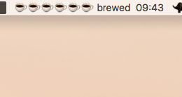

## Features

 - Shows how many cups of coffee is in the coffee pan
 - Shows when the pan was brewed
 - Shows notification when new pan is brewed

## How to install:

 1. Clone this repository to your computer
  - Run in the command line `git clone https://github.com/fastmonkeys/coffee-status.git`
 - Install bitbar https://getbitbar.com/ and set the plugin folder to `plugins` folder under this repository
 - Modify permissions of `coffee.20s.py` file with chmod so bitbar can run it
  - Go to the folder in command line
  - Run `chmod 777 coffee.20s.py`
Optional:
 - if you want to get notifications when new pan is brewed install pync
 

## Example image

